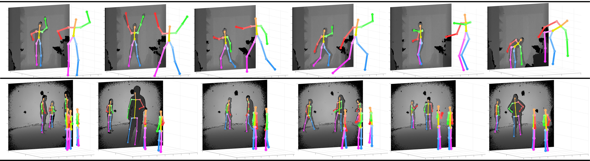

# **Residual Pose: A Decoupled Approach for Depth-based 3D Human Pose Estimation**





## **Introduction**

This is the code release of our paper ***Residual Pose: A Decoupled Approach for Depth-based 3D Human Pose Estimation***


If you happen to use the models and code for your work, please cite the following paper

```
@inproceedings{Martinez_IROS_2020,
author={Angel {Martínez-González} and Michael {Villamizar} and Olivier {Canévet} and Jean-Marc {Odobez}},
journal={IEEE/RSJ International Conference on Intelligent Robots and Systems},
title={Residual Pose: A Decoupled Approach for Depth-Based 3D Human Pose Estimation},
year={2020}
}
```

We include in this repo

* Hourglass model for multi-person 2D pose estimation from depth images.
* Our regressor NN architecture for 3D human pose estimation.
* 3D pose prior for recovering from 2D missed detections.
* Tranined models for 2D and 3D pose estimation.
* Code for obtaining 2D and 3D pose from a depth image.


## **Requirements**

* Pytorch >= 1.3
* OpenCV >= 3.4
* Python >= 3.5


## **Datasets**

We use the following datasets with single and multi-person scenarios.
Please refer to our paper for more information

1. ITOP [[link](http://domedb.perception.cs.cmu.edu/)]
2. CMU-Panoptic [[link](http://domedb.perception.cs.cmu.edu/)]


Some images from these datasets have been included in the repo for
demonstration purposes. Please refer to their sites and authors for
complete access.


## **Testing**

To test our pretrained models on data from the ITOP dataset run the following 

```
python main.py --config_file config/itop_config_file.json \
               --image_sample img_samples/itop/ITOP_train_000000000053.npy \
               --output_path output_dir
```

and to test our pretrained models on data from the CMU-Panoptic dataset run
the following

```
python main.py --config_file config/panoptic_config_file.json \
               --image_sample img_samples/panoptic/depth_02_000000005014.mat \
               --output_path output_dir
```


which will save visualizations and results `on output_dir`.


